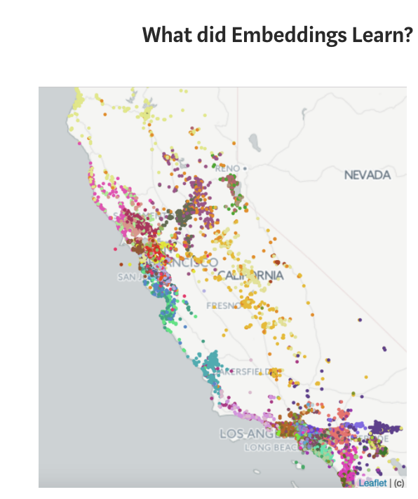
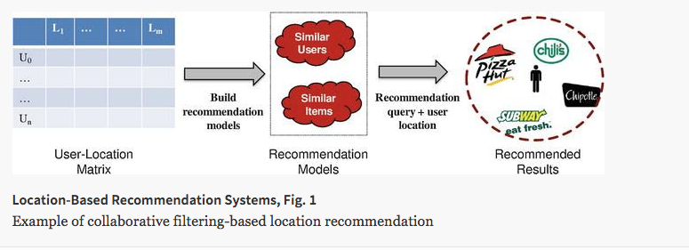
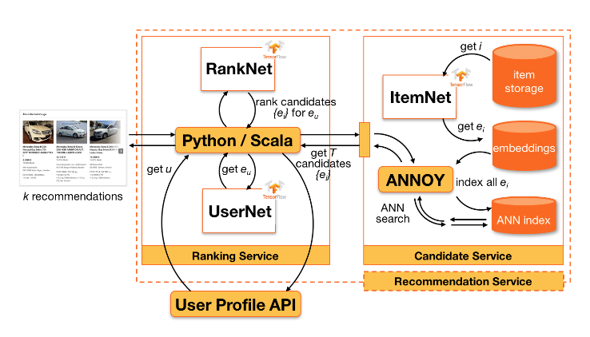

# Introduction to Recommendation Engines

Recommendations are being used to recommend everything from movies to music to friends to new destinations. There are three main methods for implementing recommendations that you will become familiar with throughout this lesson:

- Knowledge Based Recommendations
- Collaborative Filtering Based Recommendations
- Content Based Recommendations

After completing this lesson, you will be ready for the upcoming lessons where you will

- Learn about more advanced techniques.
- Deploy your recommendations in a web application.

These three lessons will aim to be extremely practical. The lessons will require that you write code to implement a number of different recommendation techniques.

## What's Ahead

**Types of Recommendations**

In this lesson, you will be working with the MovieTweetings data to apply each of the three methods of recommendations:

1. Knowledge Based Recommendations
2. Collaborative Filtering Based Recommendations
3. Content Based Recommendations

Within Collaborative Filtering, there are two main branches:

1. Model Based Collaborative Filtering
2. Neighborhood Based Collaborative Filtering

In this lesson, you will implement Neighborhood Based Collaborative Filtering. In the next lesson, you will implement Model Based Collaborative Filtering.

**Similarity Metrics**

In order to implement Neighborhood Based Collaborative Filtering, you will learn about some common ways to measure the similarity between two users (or two items) including:

1. Pearson's correlation coefficient
2. Spearman's correlation coefficient
3. Kendall's Tau
4. Euclidean Distance
5. Manhattan Distance

You will learn why sometimes one metric works better than another by looking at a specific situation where one metric provides more information than another.

**Business Cases For Recommendations**

Finally, you will look at the four ideas needed for businesses to implement successful recommendations to drive revenue, which include:

1. Relevance
2. Novelty
3. Serendipity
4. Increased Diversity

At the end of this lesson, you will have gained a ton of skills to build upon or to start creating your own recommendations in practice.

## Knowledge Based Recommendations

A knowledge based recommendation is one in which knowledge about the item or user preferences are used to make a recommendation.

Knowledge based recommendations are pretty common when purchasing luxury items. Take a look at the filters available on Zillow in the image below. This is an example of building in a knowledge based recommendation, as users can add their own preferences to the items that are provided.

Often a rank based algorithm is provided along with knowledge based recommendations to bring the most popular items in particular categories to the user's attention.

In the next concept, you will get some practice implementing this type of recommendation for the MovieTweetings dataset.

## More Personalized Recommendations
In some cases, we need to be able to send recommendations without a user telling us exactly what they want or in a more personalized way than simply the top items. Imagine you want to send an email of recommendations or place recommendations within a web page (the side of a blog or as a banner advertisement); in these cases, it is often useful to implement information that we know about users or items to make these recommendations. This leads to some additional recommendation methods!

## Collaborative Filtering
There are two main ways to implement collaborative filtering:

1. Model Based Collaborative Filtering
2. Neighborhood Based Collaborative Filtering

In this lesson, we will cover Neighborhood Based Collaborative Filtering, which is used to identify items or users that are "neighbors" with one another.

There are a number of ways we might go about finding an individual's closest neighbors - the metrics we will take a closer look at include:

1. Pearson's correlation coefficient
2. Spearman's correlation coefficient
3. Kendall's Tau
4. Euclidean Distance
5. Manhattan Distance

On the next page, you will work through a few examples to get more familiar with how each of these metrics is computed, and why you might use one over another.

## Making Recommendations

Finalizing our neighborhood based recommendations, we need to use the ratings from our neighbors to influence the ratings we provide to other users.

There are a few ways to do this, but a simple method would be to:

1. Remove movies our user has already seen.
2. Find ratings of the neighbors that are high.
3. Recommend movies to each user where both 1 and 2 above hold.

Other methods for making recommendations using collaborative filtering are based on weighting of the neighbors' ratings based on the 'closeness' of the neighbors.

You can use each of the following two papers to learn more about this technique:

1. [Domino Data Lab Paper](https://blog.dominodatalab.com/recommender-systems-collaborative-filtering/)
2. [Semantic Scholar Paper On Weighted Ratings](https://pdfs.semanticscholar.org/3e9e/bcd9503ef7375c7bb334511804d1e45127e9.pdf)

In the next notebook, you will implement the three-step process above to make recommendations for every user in the dataset. For computational reasons, you will notice that iterating this approach through all users has been done for you. But you will go through the process of implementing for individual pairs of users, which could easily be extended via looping to all users.

## Content Based Recommendations

In the previous notebook, you implemented collaborative filtering to make recommendations based on finding similar users. However, there were a number of users who did not receive recommendations when using this technique. For this reason, we might use other recommendation techniques to find items to recommend to users.

Another popular technique for making recommendations is called **content based** recommendations. In this recommendation technique, we use information that is known about the user or item to make recommendations. This method of making recommendations is particularly useful when we do not have a lot of user-item connections available in our dataset.

It might be the case that content based and collaborative filtering based techniques come up with similar recommendations, but the methods by which data scientists approach these recommendations are very different. In collaborative filtering, you are using the connections of users and items (as you did before). In content based techniques, you are using information about the users and items, but not connections (hence the usefulness when you do not have a lot of internal data already available to use).

Let's take a look at how we might implement this method with the MovieTweetings data.

## Three Types of Recommendations
There are three methods that you have now implemented for making recommendations. These are the three most recognized methods in industry:

1. Knowledge Based Recommendations

Knowledge based recommendations frequently are implemented using filters, and are extremely common amongst luxury based goods. Filters that you might see when purchasing items like cars or homes are examples of knowledge based recommendations. In knowledge based recommendations, users provide information about the types of recommendations they would like back.

2. Collaborative Filtering Based Recommendations

Collaborative filtering uses the connections between users and items to make recommendations. Even the content based recommendation you just implemented used some collaborative filtering techniques, as you were not treating items and users independent from one another. In this lesson, you used neighborhood based collaborative filtering to find users who were alike and then recommend new movies based on these similar users.

Even in the content based recommendation, you were using collaborative filtering. You were finding items that were similar and making recommendations of new items based on the highest ratings of a user. Because you were still using the user ratings of an item, this was an example of a blend between content and collaborative filtering based techniques.

3. Content Based Recommendations

In the previous notebook, you created a matrix of similarities between items (movies) based only on the content related to those movies (year and genre). The similarity matrix that was used, was completely created using only the items (movies). There was no information used about the users implemented. For any movie, you would be able to determine the most related additional movies based only on the genre and the year of the movie. This is the premise of how a completely content based recommendation would be made.

Often blended techniques of all three types are used in practice to provide the the best recommendation for a particular circumstance.

There are still more advanced techniques that are related to the methods that you learned about here, and they will most likely fall in one of the three buckets below.

- [AirBnB uses embeddings in their recommendation, which you can read more about here.](https://medium.com/airbnb-engineering/listing-embeddings-for-similar-listing-recommendations-and-real-time-personalization-in-search-601172f7603e)

- [As our smart phones become more addicting every day, it is easy to see why location based recommendations will be more and more popular. You can read more about these types of recommendations here.](https://link.springer.com/referenceworkentry/10.1007%2F978-3-319-17885-1_1580)

- [Many companies are also exploring deep learning use cases in recommendation systems.](https://ebaytech.berlin/deep-learning-for-recommender-systems-48c786a20e1a)

## Different Scales
If you are in control of choosing your rating scale, think of what might be most beneficial to your scenario. If you are working alongside a team TO design the interfaces for how data will be collected, there are number of ideas to keep in mind.

- Do you need to ask questions of your user or can you collect data about their interactions with items?
- If you need to ask questions, how many do you ask?
- How do you word the questions?
- And finally, the question in the above video: what type of scale should you use?

In general, I suggest using the simplest rating that allows you to get whatever questions of interest you have, but there are some important ideas to keep in mind when choosing a particular type of rating. Ratings are a necessary part of working with different recommendation systems, but they aren't a central part of our focus. A good overview of types of ratings and when to use them is also provided [here](https://conversionxl.com/blog/survey-response-scales/).

Most of these ideas are specific to your use case, and are easy to notice in hindsight. It is simply important to think of this in advance and not completely gloss over possible issues with the data you are collecting and how it connects to the questions you want answered.

## Business Goals of Recommendations

In general, recommendations are important because they are often central to driving revenue for a company. In the new world of the Internet, you don't always need a friend to personally recommend you an item you never heard of - instead, the recommendations can do this.

There are ultimately 4 goals to keep in mind when performing recommendations:

- **Relevance**
- **Novelty**
- **Serendipity**
- **Diversity**

Often people only think of the first goal, and it is a good reminder that focusing only on **relevance** can lead to drops in use, and therefore loss of revenue. We also need to consider the other three goals, so that recommendations can be most effective in driving sales. [In this article, Lab41 shows how they worked to quantify these metrics](https://gab41.lab41.org/recommender-systems-its-not-all-about-the-accuracy-562c7dceeaff).

# Recap

## Types of Recommendations
In this lesson, you worked with the MovieTweetings data to apply each of the three methods of recommendations:

1. Knowledge Based Recommendations
2. Collaborative Filtering Based Recommendations
3. Content Based Recommendations

Within Collaborative Filtering, there are two main branches:

1. Model Based Collaborative Filtering
2. Neighborhood Based Collaborative Filtering

In this lesson, you implemented Neighborhood Based Collaborative Filtering. In the next lesson, you will implement Model Based Collaborative Filtering.

**Similarity Metrics**

In order to implement Neighborhood Based Collaborative Filtering, you were introduced to and applied a few techniques to assess how similar or distant two users were from one another:

1. Pearson's correlation coefficient
2.Spearman's correlation coefficient
3. Kendall's Tau
4. Euclidean Distance
5. Manhattan Distance

**Types of Ratings**

We took a quick look at different types of ratings:

1. Did the user interact with an item or not.
2. Did the user like an item or not.
3. More granular scales 1-7, 1-10, etc.

It is important to understand what the data might be used for, and what type of granularity might be important for a particular case. One of the main considerations is whether you want to have neutrality available, in which case an odd number of possible values in your scale will provide a value in the middle. Another common question is, how many levels do you really need to understand how much a user likes a particular product? Again, this is largely up to individual preference and specific use cases.

**Business Cases For Recommendations**

Finally, you looked at the four ideas needed for businesses to implement successful recommendations to drive revenue, which include:

1. Relevance
2. Novelty
3. Serendipity
4. Increased Diversity

At the end of this lesson, you will have gained a ton of skills to build upon or to start creating your own recommendations in practice.

**Next Lesson**

In the upcoming lesson, we will take a closer look at model based collaborative filtering, different methods for dealing with the cold start problem, and how to assess how well our model is performing. Then as a final touch, you will have the opportunity to deploy your recommendations to the web!

