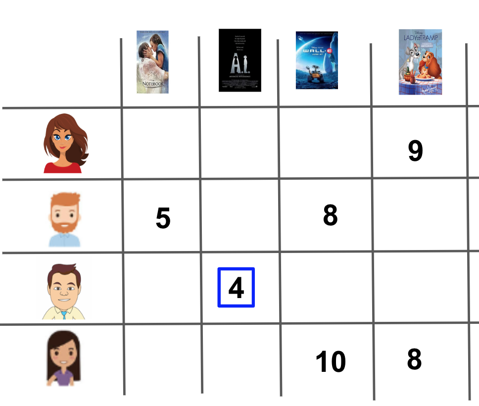
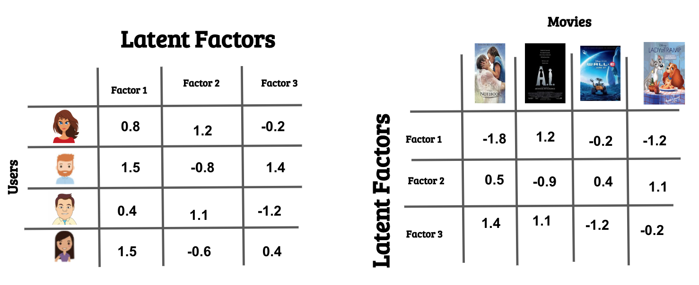

# Matrix Factorization for Recommendations

## Topics
In this lesson, you will learn about three main topics:

1. We will look from a high level at how you might go about validating your recommendations.
2. We will look at matrix factorization as a method to use machine learning to make recommendations.
3. We will look at combining recommendation techniques to make predictions to existing and new users and for existing and new items.

As we go through this lesson, you will come to realize that there are a lot of difficulties in working with recommendation engines which make them still an exciting field to study! This is especially true when you combine your recommendations with a specific product type.

Recommending movies, recommending restaurants, or recommending clothing might happen in a number of different ways. However, the techniques you will learn in this lesson are often extendable to any of these cases.

## Training and Testing Data For Recommendations
In the last lesson, you were making recommendations by providing a list of popular items, or a list of items that the user hadn't observed but that someone with similar tastes had observed. However, understanding if these recommendations are good in practice means that you have to deploy these recommendations to users and see how it impacts your metrics (sales, higher engagement, clicks, conversions, etc.).

You may not want your recommendations to go live to understand how well they work. In these cases, you will want to split your data into training and testing portions. In these cases, you can train your recommendation engine on a subset of the data, then you can test how well your recommendation engine performs on a test set of data before deploying your model to the world.

However, the cases you saw in the last lesson, where just a list of recommendations was provided, don't actually lend themselves very well to training and testing methods of evaluation. In the next upcoming pages, you will be introduced to matrix factorization, which actually does work quite well for these situations.

## Validating Your Recommendations

## Online Testing
For online methods of testing a recommender's performance, many of the methods you saw in the previous lesson work very well - you can deploy your recommendations and just watch your metrics carefully. It is common in practice to set up online recommendations to have an "old" version of recommended items, which is compared to a new page that uses a new recommendation strategy.

All ideas associated with A/B testing that you learned in the earlier lessons are critical to watching your metrics in online learning, and ultimately, choosing a recommendation strategy that works best for your products and customers.

## Offline Testing68646
In many cases, a company might not let you simply deploy your recommendations out into the real world any time you feel like it. Testing out your recommendations in a training-testing environment prior to deploying them is called **offline** testing.

The recommendation methods you built in the previous lesson actually don't work very well for offline testing. In offline testing, it is ideal to not just obtain a list of recommendations for each individual, because we ultimately don't know if a user doesn't use an item because they don't like it, or because they just haven't used it yet (but would like it). Rather, it would be great if we have an idea of how much each user would like each item using a predicted rating. Then we can compare this predicted rating to the actual rating any individual gives to an item in the future.

In the previous video, you saw an example of a user to whom we gave a list of movies that they still hadn't seen. Therefore, we couldn't tell how well we were doing with our recommendations. Techniques related to matrix factorization lend themselves nicely to solving this problem.

## User Groups

The final (possible) method of validating your recommendations is by having user groups give feedback on items you would recommend for them. Obtaining good user groups that are representative of your customers can be a challenge on its own. This is especially true when you have a lot of products and a very large consumer base.

## Singular Value Decomposition

In the next part of this lesson, you will first get exposure to Singular Value Decomposition, or SVD. We will soon see why this technique falls short for many recommendation problems. However, understanding traditional SVD approaches to matrix factorization is useful as a start to a number of matrix factorization techniques that are possible in practice.

In order to implement SVD for many recommendation engines, we will need to use a slightly modified approach known as FunkSVD. This approach proved to work incredibly well during the [Netflix](https://en.wikipedia.org/wiki/Netflix_Prize) competition, and therefore, it is one of the most popular recommendation approaches in use today.

Let's first take a closer look at traditional SVD.

## Latent Factors
When performing SVD, we create a matrix of users by items (or customers by movies in our specific example), with user ratings for each item scattered throughout the matrix. An example is shown in the image below.
<center>


</center>

You can see that this matrix doesn't have any specific information about the users or items. Rather, it just holds the ratings that each user gave to each item. Using SVD on this matrix, we can find **latent features** related to the movies and customers. This is amazing because the dataset doesn't contain any information about the customers or movies!

# Singular Value Decomposition

Let's do a quick check of understanding. If we let AA be our user-item matrix, we can write the decomposition of that matrix in the following way.


## Singular Value Decomposition Takeaways

Three main takeaways from the previous notebook:

1. The latent factors retrieved from SVD aren't actually labeled.
2. We can get an idea of how many latent factors we might want to keep by using the Sigma matrix.
3. SVD in NumPy will not work when our matrix has missing values. **This makes this technique less than useful for our current user-movie matrix.**

## SVD Closed Form Solution

**What Is A Closed Form Solution?**

A closed form solution is one where you can directly find the solution values (unlike iterative solutions, which are commonly used in practice). There isn't an iterative approach to solving a particular equation. One of the most popular examples of a closed form solution is the solution for multiple linear regression. That is if we want to find an estimate for \betaβ in the following situation:

$$y = X\beta y=Xβ$$

We can find it by computing the Best Linear Unbiased Estimate (BLUE). It can be found in closed form using the equation:

$$\hat{\beta} = (X'X)^-X'y 
β
^
​	 =(X 
′
 X) 
−
 X 
′
 y$$

where X is a matrix of explanatory inputs and y is a response vector.

Another common example of a closed form solution is the quadratic equation. If we want to find x that solves:

$$ax^2 + bx + c = 0ax 
2
 +bx+c=0$$

We can find these values using the quadratic formula:

$$
x = \frac{-b \pm \sqrt{b^2 - 4ac}}{2a}x= 
2a
−b± 
b 
2
 −4ac
$$
​	 

**Each of these is an example of a closed form solution, because in each case we have an equation that allows us to solve directly for our values of interest.**

**Closed Form Solutions for SVD**

It turns out there is a closed form solution for Singular Value Decomposition that can be used to identify each of the matrices of interest (U, \Sigma, VU,Σ,V). The most straightforward explanation of this closed form solution can be found at this MIT link.

As put in the paper -

"Calculating the SVD consists of finding the eigenvalues and eigenvectors of $AA'AA$ and $A'AA$ 
′
 A. The eigenvectors of $A'AA$ 
′
 A make up the columns of VV, the eigenvectors of $AA'AA$ make up the columns of $UU$. Also, the singular values in \SigmaΣ are square roots of eigenvalues from AA'AA or A'AA

 A. The singular values are the diagonal entries of the \sigmaσ matrix and are arranged in descending order. The singular values are always real numbers. If the matrix AA is a real matrix, then UU and $VV$ are also real."

Again, you can see a fully worked example of the closed form solution at the [MIT Link here](http://web.mit.edu/be.400/www/SVD/Singular_Value_Decomposition.htm).

**A More Common Approach**

The main issue with the closed form solution (especially for us) is that it doesn't actually work when we have missing data. Instead, Simon Funk (and then many followers) came up with other solutions for finding our matrices of interest in these cases using **gradient descent**.

So all of this is to say, people don't really use the closed form solution for SVD, and therefore, we aren't going to spend a lot of time on it either. The link above is all you need to know. Now, we are going to look at the main way that the matrices in SVD are estimated, as this is what is used for estimating values in FunkSVD.

**Additional Resources**

Below are some additional resources in case you are looking for others that go beyond what was shown in the simplified MIT paper.

[Stanford Discussion on SVD](http://infolab.stanford.edu/~ullman/mmds/ch11.pdf)

[Why are Singular Values Always Positive on StackExchange](https://math.stackexchange.com/questions/2060572/why-are-singular-values-always-non-negative)

[An additional resource for SVD in Python](https://machinelearningmastery.com/singular-value-decomposition-for-machine-learning/)

[Using Missing Values to Improve Recommendations in SVD]()

## Funk SVD Practice
In the notebook on the next page, you will be writing the code to implement Funk SVD. Before you dive in, let's do a practice run here.

First, consider we have a user-item matrix that looks like the matrix below, where we want to make an update of U and V matrices based on the 4 highlighted.



Also consider we have the following U and V matrices:



This is the same process you will use to update each value in the matrix:

```

u_new = u_old + {learn_rate * 2 * (actual - pred) * v_old}

```

## The Cold Start Problem

The **cold start problem** is the problem that new users and new items to a platform don't have any ratings. Because these users and items don't have any ratings, it is impossible to use collaborative filtering methods to make recommendations.

Therefore, methods you used in the previous lesson like (rank-based and content-based recommenders) are the only way to get started with making recommendations for these individuals.

# Conclusion
In this lesson, you got your hands on some of the most important ideas associated with recommendation systems:

## Recommender Validation

You looked at methods for validating your recommendations (when possible) using offline methods. In these cases, you could split your data into training and testing data. Frequently this split is based on time, where events earlier in time are in the training data, and events later in time are in a testing dataset.

We also quickly introduced the idea of being able to see how well your recommendation engine works by simply throwing it out into the world to directly see the impact.

## Matrix Factorization with SVD

Next, we looked at matrix factorization as a technique for making recommendations. Traditional singular value decomposition a technique can be used when your matrices have no missing values. In this decomposition technique, a user-item (A) can be decomposed as follows:

$$
A=UΣV^T
$$ 

Where

- $U$ gives information about how users are related to latent features.
- $\Sigma$ gives information about how much latent features matter towards recreating the user-item matrix.
- $V^T$ gives information about how much each movie is related to latent features.

Since this traditional decomposition doesn't actually work when our matrices have missing values, we looked at another method for decomposing matrices.

## FunkSVD
FunkSVD was a new method that you found to be useful for matrices with missing values. With this matrix factorization you decomposed a user-item (A) as follows:

$$
A = UV^T 
$$ 

Where

- $UU$ gives information about how users are related to latent features.
- $V^T$ gives information about how much each movie is related to latent features.

You found that you could iterate to find the latent features in each of these matrices using gradient descent. You wrote a function to implement gradient descent to find the values within these two matrices.

Using this method, you were able to make a prediction for any user-movie pair in your dataset. You also could use it to test how well your predictions worked on a train-test split of the data. However, this method fell short with new users or movies.

## The Cold Start Problem
Collaborative filtering using FunkSVD still wasn't helpful for new users and new movies. In order to recommend these items, you implemented content based and ranked based recommendations along with your FunkSVD implementation.

**Author's Note**
There are so many ways to make recommendations, and this course provides you a very strong mind and skill set to tackle building your own recommendation systems in practice.
