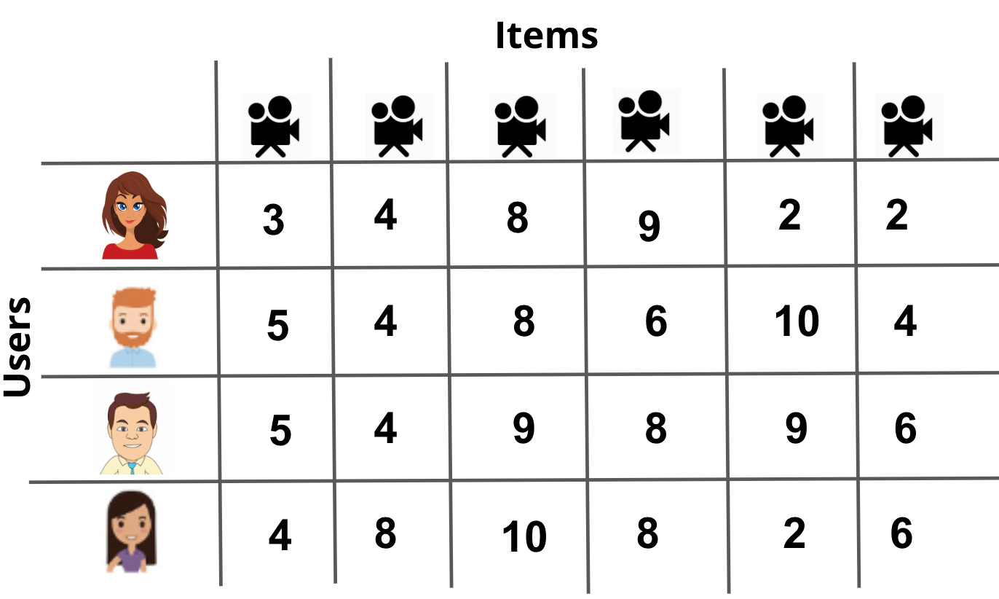

# Matrix Factorization for Recommendations

## Topics
In this lesson, you will learn about three main topics:

1. We will look from a high level at how you might go about validating your recommendations.
2. We will look at matrix factorization as a method to use machine learning to make recommendations.
3. We will look at combining recommendation techniques to make predictions to existing and new users and for existing and new items.

As we go through this lesson, you will come to realize that there are a lot of difficulties in working with recommendation engines which make them still an exciting field to study! This is especially true when you combine your recommendations with a specific product type.

Recommending movies, recommending restaurants, or recommending clothing might happen in a number of different ways. However, the techniques you will learn in this lesson are often extendable to any of these cases.

## Training and Testing Data For Recommendations
In the last lesson, you were making recommendations by providing a list of popular items, or a list of items that the user hadn't observed but that someone with similar tastes had observed. However, understanding if these recommendations are good in practice means that you have to deploy these recommendations to users and see how it impacts your metrics (sales, higher engagement, clicks, conversions, etc.).

You may not want your recommendations to go live to understand how well they work. In these cases, you will want to split your data into training and testing portions. In these cases, you can train your recommendation engine on a subset of the data, then you can test how well your recommendation engine performs on a test set of data before deploying your model to the world.

However, the cases you saw in the last lesson, where just a list of recommendations was provided, don't actually lend themselves very well to training and testing methods of evaluation. In the next upcoming pages, you will be introduced to matrix factorization, which actually does work quite well for these situations.

## Validating Your Recommendations

## Online Testing
For online methods of testing a recommender's performance, many of the methods you saw in the previous lesson work very well - you can deploy your recommendations and just watch your metrics carefully. It is common in practice to set up online recommendations to have an "old" version of recommended items, which is compared to a new page that uses a new recommendation strategy.

All ideas associated with A/B testing that you learned in the earlier lessons are critical to watching your metrics in online learning, and ultimately, choosing a recommendation strategy that works best for your products and customers.

## Offline Testing68646
In many cases, a company might not let you simply deploy your recommendations out into the real world any time you feel like it. Testing out your recommendations in a training-testing environment prior to deploying them is called **offline** testing.

The recommendation methods you built in the previous lesson actually don't work very well for offline testing. In offline testing, it is ideal to not just obtain a list of recommendations for each individual, because we ultimately don't know if a user doesn't use an item because they don't like it, or because they just haven't used it yet (but would like it). Rather, it would be great if we have an idea of how much each user would like each item using a predicted rating. Then we can compare this predicted rating to the actual rating any individual gives to an item in the future.

In the previous video, you saw an example of a user to whom we gave a list of movies that they still hadn't seen. Therefore, we couldn't tell how well we were doing with our recommendations. Techniques related to matrix factorization lend themselves nicely to solving this problem.

## User Groups

The final (possible) method of validating your recommendations is by having user groups give feedback on items you would recommend for them. Obtaining good user groups that are representative of your customers can be a challenge on its own. This is especially true when you have a lot of products and a very large consumer base.

## Singular Value Decomposition

In the next part of this lesson, you will first get exposure to Singular Value Decomposition, or SVD. We will soon see why this technique falls short for many recommendation problems. However, understanding traditional SVD approaches to matrix factorization is useful as a start to a number of matrix factorization techniques that are possible in practice.

In order to implement SVD for many recommendation engines, we will need to use a slightly modified approach known as FunkSVD. This approach proved to work incredibly well during the [Netflix](https://en.wikipedia.org/wiki/Netflix_Prize) competition, and therefore, it is one of the most popular recommendation approaches in use today.

Let's first take a closer look at traditional SVD.

## Latent Factors
When performing SVD, we create a matrix of users by items (or customers by movies in our specific example), with user ratings for each item scattered throughout the matrix. An example is shown in the image below.

You can see that this matrix doesn't have any specific information about the users or items. Rather, it just holds the ratings that each user gave to each item. Using SVD on this matrix, we can find **latent features** related to the movies and customers. This is amazing because the dataset doesn't contain any information about the customers or movies!

## Singular Value Decomposition

Let's do a quick check of understanding. If we let AA be our user-item matrix, we can write the decomposition of that matrix in the following way.

